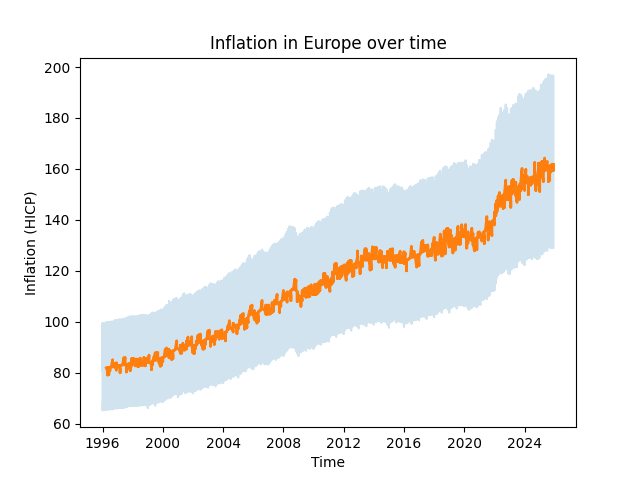

# 📊 European Inflation Data Pipeline

## 🚀 Project Overview
This project analyzes inflation trends in Europe using Eurostat data.

It demonstrates a complete data workflow:
- Data extraction (Eurostat API)
- Data storage in PostgreSQL
- Data analysis with Python
- Visualization of inflation trends

---

## 🛠️ Tech Stack
- Python (pandas, matplotlib)
- PostgreSQL
- Git & GitHub

---

## 📂 Project Structure

european-inflation-pipeline/
│
├── ingestion/ # Data extraction & loading scripts
│ └── fetch_eurostat.py
│
├── notebooks/ # Data analysis (Jupyter)
│ └── analysis.ipynb
│
├── outputs/ # Generated visualizations
│ └── inflation_evolution.png
│
├── requirements.txt # Python dependencies
└── .gitignore

---

## 📈 Key Insights
- Inflation steadily increased from 1996 to 2008
- Stability period between 2010–2019
- Sharp increase after 2021 (post-COVID & energy crisis)

---

## 📊 Example Output

---

## ⚙️ How to Run

1. Install dependencies:
pip install -r requirements.txt
2. Run ingestion:
python ingestion/fetch_eurostat.py
3. Open notebook:
notebooks/analysis.ipynb

